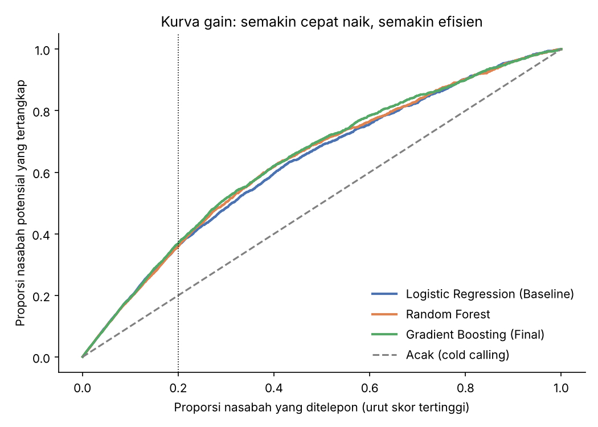

# Bank Customer Classification for Time Deposit — Lead Scoring Model

Final project Data Science Basic Study Club (Veterantech). Model klasifikasi yang memberi **skor probabilitas** tiap nasabah untuk berlangganan deposito berjangka, sehingga tim telemarketing bisa fokus ke ~20% nasabah paling potensial, bukan cold calling massal.

## Masalah & tujuan
- Cold calling menghasilkan konversi rendah dan biaya operasional tinggi.
- Tujuan bisnis: efisiensi telemarketing naik (kurangi panggilan ke nasabah non-potensial).
- Tujuan teknis: model klasifikasi stabil dengan Precision >80% dan identifikasi faktor penentu keputusan nasabah.

## Data
`data/bank.csv` — 11.162 baris (tidak ada duplikat), 16 fitur + target `deposit` (47,4% Yes). Dataset publik Bank Marketing. Nilai kosong ada di `pdays` (-1 = belum pernah dihubungi), `contact`, `education`, `job` ("unknown").

## Alur
1. **Split dulu** (80/20, stratified), baru preprocessing -> tidak ada data leakage.
2. **Preprocessing dalam `Pipeline`:** "unknown" -> modus, `pdays=-1` -> median, IQR capping `balance`, StandardScaler, One-Hot Encoding. Semua dipelajari hanya dari data train.
3. **Fitur tambahan:** `contacted_before` (pernah dihubungi di kampanye sebelumnya) dan `has_loan_any` (punya KPR atau pinjaman pribadi).
4. **Model:** Logistic Regression (baseline), Random Forest, dan Gradient Boosting (final).
5. **Evaluasi:** Precision, Recall, ROC-AUC, plus **capture rate, precision, dan lift di Top 20%**, semuanya dengan interval kepercayaan 95% (bootstrap).

## Hasil (test set, 2.233 nasabah, tanpa `duration`)
| Metrik | Logistic Reg. | Random Forest | Gradient Boosting (final) |
|---|---|---|---|
| ROC-AUC | 0,745 | 0,757 | 0,766 (CI 0,747–0,786) |
| Precision (ambang 0,5) | 0,722 | 0,769 | 0,779 |
| Recall (ambang 0,5) | 0,547 | 0,547 | 0,555 |
| Precision Top 20% | 0,857 | 0,850 | 0,874 (CI 0,841–0,904) |
| Capture Top 20% | 36,1% | 35,8% | 36,9% |
| Lift Top 20% | 1,81x | 1,79x | 1,85x |



**Cara membaca:** menelepon hanya 20% nasabah dengan skor tertinggi menghasilkan ±87% yang benar-benar deposit (vs ±47% jika acak) dan menangkap ±37% dari semua nasabah potensial.

**Target Precision >80%:** dicapai pada ambang skor 0,56 (dipilih dari cross-validation di data train, bukan test). Di test set: precision 82,4% dengan menelepon 29,8% nasabah dan menangkap 51,8% nasabah potensial.

**Faktor terpenting** (permutation importance): bulan kontak, hasil kampanye sebelumnya (`poutcome`), punya pinjaman, usia, dan saldo.

## Catatan kejujuran: perbedaan antar model kecil
Dalam 5-fold CV berulang 3x di data train, ROC-AUC ketiga model berkisar 0,748–0,759 dengan simpangan baku ±0,01. Selisih Gradient Boosting vs Random Forest hanya ±0,001 pada AUC (tidak signifikan, p=0,25) dan ±0,005 pada precision Top 20% (p=0,09). Interval kepercayaan ketiga model saling tumpang tindih, jadi jangan membaca selisih di tabel di atas sebagai kemenangan yang pasti. Kesimpulan yang aman: **ketiga model setara, dan batas performa ada pada data, bukan pada pilihan algoritma**. Gradient Boosting dipilih sebagai model final karena sedikit unggul dan stabil di CV.

## Catatan penting: fitur `duration`
`duration` (lama telepon) baru diketahui **setelah** telepon selesai, jadi tidak tersedia saat memutuskan siapa yang ditelepon. Jika dipakai, ROC-AUC naik ke ±0,91, tetapi angka itu terlalu optimis untuk lead scoring nyata. Default-nya **dikeluarkan** (`USE_DURATION = False` di `src/lead_scoring.py`).

## Keterbatasan
- Dataset ini kampanye masa lalu: nasabah yang dihubungi bukan sampel acak dari seluruh nasabah (selection bias), sehingga performa di kampanye baru bisa berbeda.
- Tidak ada informasi biaya per panggilan, jadi penghematan belum dihitung dalam rupiah.

## Cara menjalankan
```bash
pip install -r requirements.txt
python src/lead_scoring.py
```
Output: tabel metrik di terminal dan di `reports/` (metrics.csv, confusion matrix, kurva gain, feature importance).

## Struktur
```
docs/FP_TSC_Bank_Lead_Scoring_Samuel_Geraldo.pptx   # slide presentasi (ringkasan proyek)
notebooks/FP_Samuel_Geraldo.ipynb   # analisis lengkap dengan output (Colab)
src/lead_scoring.py                 # pipeline versi skrip
data/bank.csv
reports/                            # metrik dan grafik hasil run
requirements.txt
```

Analisis lengkap (Business Understanding sampai Evaluation) ada di notebook; `src/lead_scoring.py` adalah versi skrip dari pipeline yang sama, dan slide presentasi ada di `docs/`. Angka kecil bisa sedikit berbeda antar-run karena versi library.
